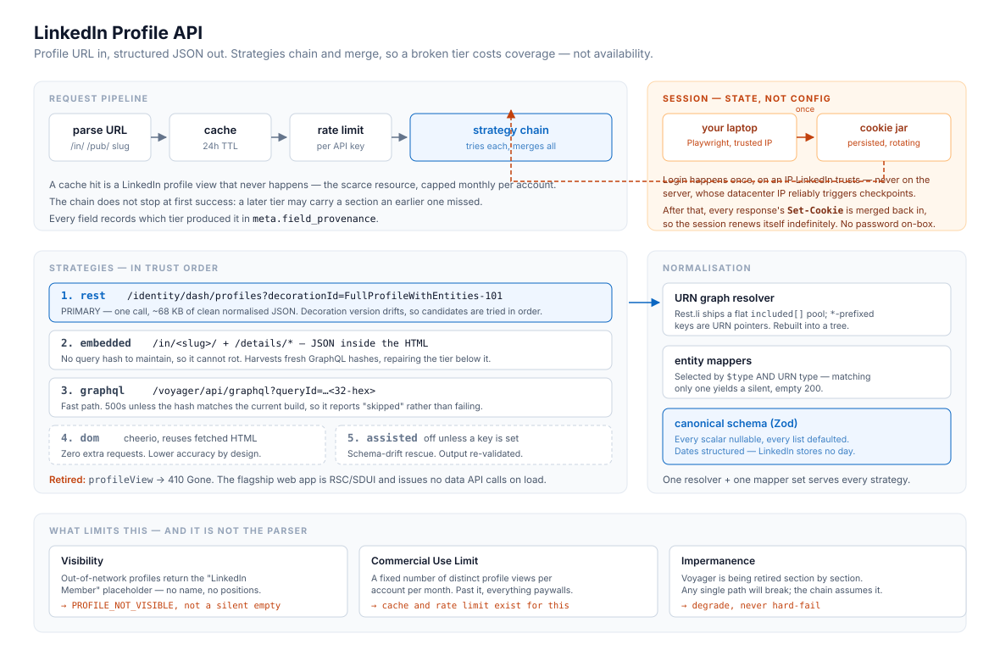

# LinkedIn Profile API

A hosted API that takes a LinkedIn profile URL and returns the profile as structured JSON.

It works by calling LinkedIn's internal **Voyager** endpoints with an authenticated session, rather than by rendering and scraping the page. Extraction runs as a chain of independent strategies whose outputs are merged, so a strategy breaking costs coverage rather than availability.



---

## Quick start

```bash
git clone https://github.com/rohhann12/linkedin-rev-eng.git
cd linkedin-rev-eng
npm install
cp .env.example .env      # then add a session, see below
npm run dev               # http://localhost:3000
```

There's a browser playground at `/` — paste a profile URL and it shows the JSON plus which strategy produced it.

### Getting a session

The API needs an authenticated LinkedIn session. Two ways to supply one:

**Interactively (recommended).** Opens a real browser, you log in by hand:

```bash
npx playwright install chromium
npm run mint                              # prints a cookie header for .env
npm run mint -- --push https://your-host  # or POSTs it straight to a deployment
```

**By hand.** From DevTools → Application → Cookies → `www.linkedin.com`, copy the whole cookie header into `.env`:

```bash
LINKEDIN_COOKIE='li_at=…; JSESSIONID="ajax:…"; lidc=…; bcookie=…'
```

Send the full header rather than just `li_at` — LinkedIn's edge also wants the `lidc` routing cookie and Cloudflare's `__cf_bm`.

---

## API

### `GET /v1/profile`

```bash
curl "http://localhost:3000/v1/profile?url=https://www.linkedin.com/in/williamhgates/"
```

| Parameter | Default | Meaning |
|---|---|---|
| `url` | *required* | A LinkedIn member profile URL |
| `deep` | `false` | Fetch complete section lists rather than the page's previews. Costs extra upstream calls. |
| `include` | — | Comma-separated opt-ins: `contact`, `activity` |
| `refresh` | `false` | Bypass the cache |

`POST /v1/profile` takes the same fields as a JSON body.

**`url` is deliberately forgiving.** All of these resolve to the same profile:

```
https://www.linkedin.com/in/williamhgates/          canonical
linkedin.com/in/williamhgates                       no scheme
https://uk.linkedin.com/in/williamhgates            country subdomain
.../in/williamhgates/details/experience/            pasted from a section page
https://www.linkedin.com/pub/bill-gates/1/2/3       legacy /pub/ URL
.../in/%C3%A9lodie-martin                           percent-encoded vanity name
.../in/ACoAAD_GsjoB-vd8…                            opaque member id
williamhgates                                       bare slug
```

Company, school and job URLs are rejected with `INVALID_URL` and a reason, rather than returning an empty profile.

### Response

```jsonc
{
  "profile": {
    "public_identifier": "williamhgates",
    "urn": "urn:li:fsd_profile:ACoAAA…",
    "name": { "first": "Bill", "last": "Gates", "full": "Bill Gates", "pronouns": null },
    "headline": "Chair, Gates Foundation…",
    "about": "…",
    "location": { "raw": "Seattle, Washington, United States",
                  "city": "Seattle", "country": "United States" },
    "images": { "avatar": [{ "url": "…", "width": 800, "height": 800 }], "banner": [] },
    "experience": [{
      "title": "Co-chair",
      "company": { "name": "Bill & Melinda Gates Foundation", "urn": "urn:li:fsd_company:…" },
      "start": { "year": 2000, "month": 1 }, "end": null, "is_current": true
    }],
    "education": [], "skills": [], "certifications": [], "languages": [],
    "projects": [], "honors": [], "volunteering": [], "publications": [],
    "featured": [], "activity": [], "contact_info": null
  },
  "meta": {
    "schema_version": "1.0",
    "fetched_at": "2026-08-27T02:41:00.000Z",
    "strategies": [{ "name": "rest", "status": "ok", "duration_ms": 412, "error": null }],
    "field_provenance": { "headline": "rest", "experience": "rest" },
    "partial": false,
    "warnings": [],
    "cache": "miss"
  }
}
```

Three schema rules, applied consistently:

- **Every scalar is nullable, every collection defaults to `[]`.** Profiles are genuinely sparse and field visibility depends on the viewing session's relationship to the member. Absence is a normal outcome, not an error.
- **Dates are structured, not ISO strings.** LinkedIn stores no day for a position. Inventing one would be a lie in the data.
- **`meta.field_provenance` attributes every populated field to the strategy that produced it** — so a consumer can tell parsed data from inferred, and a maintainer can see a tier degrading before it fails.

### Other endpoints

| Endpoint | Purpose |
|---|---|
| `GET /v1/health` | Liveness + session state (source, cookies held, rotation count). `503` when the session is dead. |
| `GET /v1/architecture` | How the service works |
| `GET /v1/workflow` | How it was built |
| `GET /openapi.json` | OpenAPI 3.1 document |
| `POST /v1/admin/session` | Reseed the session. Bearer `ADMIN_TOKEN`. |
| `POST /v1/admin/cache/purge` | Drop every cached variant of one profile |

### Errors

Every failure returns a typed code, because out-of-network, auth-walled, rate-limited and session-expired all need different responses from a caller and would otherwise all be a bare `502`.

```json
{ "error": { "code": "PROFILE_NOT_VISIBLE", "message": "…", "retryable": false } }
```

`INVALID_URL` · `UNAUTHORIZED` · `RATE_LIMITED` · `PROFILE_NOT_FOUND` · `PROFILE_NOT_VISIBLE` · `AUTH_WALL` · `SESSION_EXPIRED` · `SESSION_MISSING` · `UPSTREAM_BLOCKED` · `UPSTREAM_TIMEOUT` · `ALL_STRATEGIES_FAILED` · `UNEXPECTED_PAYLOAD`

---

## Approach

### Why not scrape the page

LinkedIn's flagship web app is now React Server Components with server-driven UI. Loading a profile issues **no data API calls at all** — it posts to `/flagship-web/rsc-action/…` and receives RSC flight payloads wrapping SDUI component trees, with hashed class names and no stable field names. Parsing that means walking a serialised UI tree that changes shape on every deploy.

The legacy Voyager REST surface, meanwhile, is still live and still returns clean JSON. It is the least fashionable target and by a distance the best one.

### The strategy chain

| Tier | Surface | Role |
|---|---|---|
| `rest` | `/voyager/api/identity/dash/profiles` with `decorationId=…FullProfileWithEntities-101` | **Primary.** One call, ~68 KB: profile, positions, position groups, education, projects, skills, featured media, and the companies and schools they reference. |
| `embedded` | JSON inside the profile HTML, plus `/details/*` sub-pages | Fallback. Needs no query hash, so it can't rot the way GraphQL does — and it harvests fresh GraphQL hashes, repairing the tier below it. |
| `graphql` | `/voyager/api/graphql?queryId=…` | Fast path. 500s unless the hash matches the current build, so it reports `skipped` rather than failing. |
| `dom` | cheerio over HTML already fetched | Last resort. Zero extra requests, lower accuracy by design. |
| `assisted` | Optional model call, off unless a key is set | Schema-drift rescue. Output re-validated against the same schema. |

The chain **does not stop at the first success** — a later tier may carry a section an earlier one missed, and merging is cheaper than a second request from the caller.

### The bit that's actually hard

Voyager answers in Rest.li's normalised envelope: a flat, de-duplicated `included[]` entity pool, plus a `data` skeleton whose `*`-prefixed keys are URN pointers into it. Nothing is nested — a position's company, its logo, and the logo's image artifacts are four separate entries linked by URN.

```jsonc
{
  "data":     { "*elements": ["urn:li:fsd_profile:ACoAAA"] },
  "included": [
    { "entityUrn": "urn:li:fsd_profilePosition:1", "title": "Analyst",
      "*company": "urn:li:fsd_company:99" },
    { "entityUrn": "urn:li:fsd_company:99", "name": "Analytical Engines" }
  ]
}
```

`src/linkedin/restli.ts` is the graph resolver that rebuilds this into a tree. Because it follows pointers recursively, nested chains resolve without special-casing — engagement counts on a post sit two hops deep (`UpdateV2 → *socialDetail → *totalSocialActivityCounts`) and need no bespoke code.

Every strategy produces this same envelope, which is why there's one resolver and one set of mappers rather than three.

### Session management

The session is treated as **mutable runtime state, not configuration**. A cookie header in an env var is a photograph of a session at one instant; the session itself keeps moving.

Every Voyager response carries `Set-Cookie` — `lidc` on almost every call, `li_at` periodically, `__cf_bm` every half hour. Those are merged back into the jar and persisted to disk (0600, written-then-renamed). The credential held is always the one LinkedIn most recently issued, so a session survives indefinitely without anyone re-entering a password.

Minting happens on a trusted machine, never the server:

- LinkedIn fingerprints datacenter IP ranges. A first login from EC2, on a fresh browser profile, from an unfamiliar country is close to a maximum-suspicion signal — it triggers the exact checkpoint the automation was meant to avoid.
- It keeps the account password off the server entirely. The box only ever holds a cookie, delivered over TLS through an authenticated endpoint.

### Findings

Verified against a live authenticated session, 2026-08-26:

- **`profileView` returns 410 Gone.** The single-call endpoint most write-ups still recommend is retired.
- **Entities are tagged `$type: com.linkedin.voyager.dash.identity.profile.*`**, not by `fsd_*` URN type. Selecting on only one of the two produces the worst possible failure: a clean `200`, a valid schema, and every section silently empty. Selection matches both and unions.
- **`accept: application/vnd.linkedin.normalized+json+2.1`** is what flips responses into the flat normalised form. Without it you get a deeply nested blob.
- **`decorationId` version suffixes drift.** Candidates are tried in order rather than pinning one.
- **`profileUpdatesV2` needs `numLikes=1&numComments=1`.** At `0` the server omits the `SocialActivityCounts` entities entirely and every engagement count reads `null`.
- **Activity URNs are Snowflake ids** — the high 41 bits are epoch millis, so a post's timestamp comes free from its id, with no extra request and no parsing of relative strings like "2w".
- **Contact hydration is `profileContactInfo`**, the endpoint behind the profile page's "Contact info" overlay, also reachable as a plain page at `/in/<slug>/overlay/contact-info/`. It only yields an email for 1st-degree connections who chose to share one — which is why enrichment vendors infer addresses from the employer domain and verify over SMTP rather than reading them here.

---

## Limitations

**The parser is not the limiting factor — visibility is.**

- **Out-of-network profiles** return LinkedIn's `LinkedIn Member` placeholder with no name or positions. No amount of parsing recovers what LinkedIn declined to send. Reported as `PROFILE_NOT_VISIBLE` rather than disguised as an empty profile.
- **The Commercial Use Limit** caps distinct profile views per account per month. Past it, every profile returns a paywall until it resets. This is the real ceiling on throughput, and the reason the cache and rate limiter exist.
- **Rate limiting is aggressive and undocumented.** Expect `429` and soft blocks. Requests are serialised with a jittered floor between them.
- **Empty sections are ambiguous.** LinkedIn doesn't distinguish "member has none" from "not visible to this session". Flagged in `meta.warnings` rather than guessed at.
- **Voyager is on borrowed time.** The frontend has moved to server-driven UI and these endpoints are being retired section by section. The chain assumes any single path will break.
- **Automated access is contrary to LinkedIn's User Agreement §8.2** and carries a real risk of account restriction at volume. *hiQ v. LinkedIn* established that scraping public data isn't a CFAA crime, but that's a criminal-liability ruling — it doesn't make it contractually permitted, and these endpoints require an authenticated session, so "public data" doesn't cleanly apply. The sanctioned alternatives are your own data export, or the official Profile API under partner approval.

---

## Deploying

```bash
ADMIN_TOKEN=$(openssl rand -hex 24) ./deploy/launch-ec2.sh
DOMAIN=api.example.com ./deploy/launch-ec2.sh    # provisions TLS via Caddy
```

Launches an EC2 instance, installs Node and Caddy, runs the API under systemd with `ProtectSystem=strict`. **No credential is baked into user-data or the AMI** — user-data is readable from the instance metadata service, so the session arrives afterwards over TLS:

```bash
ADMIN_TOKEN=… npm run mint -- --push http://<ip>
```

Set `API_KEYS` before exposing this publicly, or you're donating your account's monthly view budget to the internet.

---

## Testing

```bash
npm test        # 45 tests
npm run typecheck
```

The normalisers are tested against committed fixtures rather than live calls, for two reasons: every live test is a profile view against a capped monthly budget, and a reviewer opening this repo after the session has expired can still run the whole suite.

---

## Layout

```
src/
  app.ts                    Express app, routes, middleware
  schema.ts                 canonical Zod schema
  errors.ts                 error taxonomy
  cache.ts  rate-limit.ts   memory or Upstash; fixed-window limiter
  docs.ts                   /v1/architecture and /v1/workflow
  linkedin/
    client.ts               authenticated HTTP, throttle, error mapping
    session.ts              rotating jar, disk + cache persistence
    cookie-jar.ts           parse / merge Set-Cookie / serialise
    restli.ts               URN graph resolver
    extract.ts              strategy chain + merge
    url.ts                  profile URL parsing
    query-ids.ts            GraphQL hash registry, self-healing
    fetchers/               rest · embedded · graphql · dom · assisted
    normalize/              dash mappers, helpers, merge + provenance
scripts/mint-session.ts     interactive Playwright login
deploy/                     EC2 launch + cloud-init
tests/                      offline fixture tests
```
